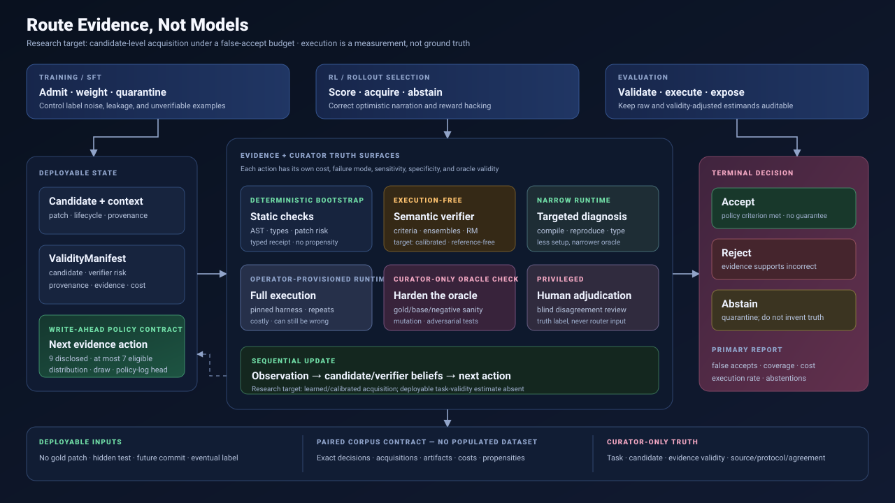
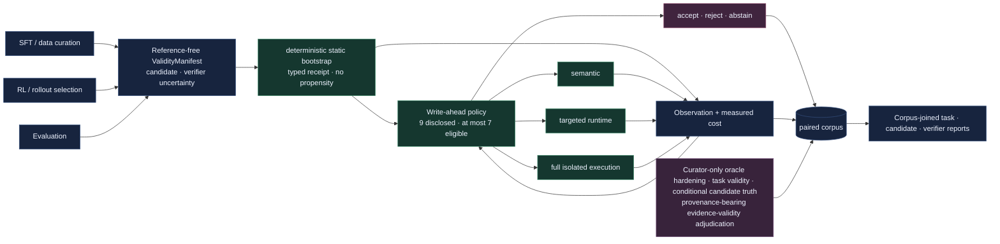
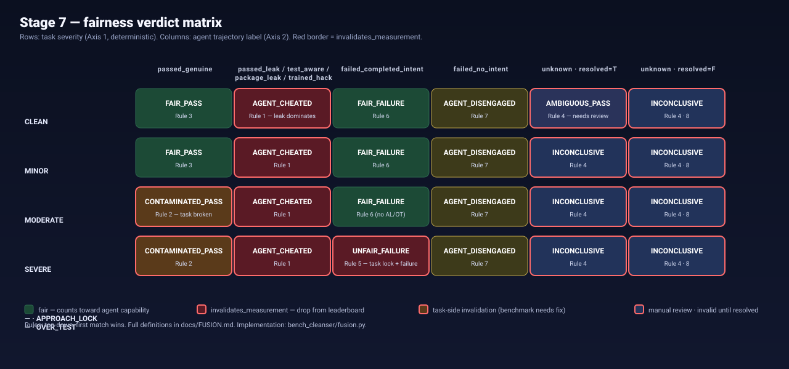

<div align="center">

# bench-cleanser

**Risk-adaptive, evidence-grounded verification for SWE-agent training data, rollouts, and evaluation.**

*An engineering-alpha toolkit for studying and logging when static, semantic, targeted, or full-execution evidence should be acquired.*

<p>
  <a href="https://github.com/v-liaozhu/bench-cleanser/actions/workflows/ci.yml"></a>
  <a href="https://www.python.org/downloads/"></a>
  <a href="LICENSE"></a>
  
  
</p>

<p>
  <a href="https://docs.astral.sh/ruff/"></a>
  <a href="https://mypy.readthedocs.io/"></a>
  <a href="https://docs.pydantic.dev/"></a>
  <a href="https://platform.openai.com/docs/guides/structured-outputs"></a>
  <a href="https://github.com/swe-bench/SWE-bench"></a>
  <a href="https://docent.transluce.org/"></a>
</p>



</div>

---

> **Why does this exist?** The SWE-bench family is the de-facto benchmark for evaluating, and increasingly for training, coding agents. A test result answers *"did this candidate pass this harness?"* It does **not** answer *"is the candidate correct, is the task valid, and was this harness an informative oracle?"* `bench-cleanser` makes the uncertainty declarations, evidence, and acquisition history machine-readable and auditable; it does not make them calibrated or correct by construction.
>
> Contaminated or weakly verified rows can inject misleading supervision into SFT/RL and can distort published scores. This project is designed to make those risks inspectable before training, rollout selection, or evaluation—not to certify a row automatically.

> [!WARNING]
> This repository is an **engineering alpha**, not a validated verifier and not a production release. The deterministic router is an inspectable baseline; its scores are not calibrated probabilities, and no downstream training gain is claimed yet. See the [research program](docs/RESEARCH_PROGRAM.md) and [release gates](docs/RELEASE_READINESS.md).

---

## Table of contents

- [Positioning](#positioning) · what this is and is not
- [Research thesis — Route Evidence, Not Models](#research-thesis--route-evidence-not-models)
- [The two-axis model](#the-two-axis-model)
- [Architecture at a glance](#architecture-at-a-glance)
- [Fairness verdict matrix](#fairness-verdict-matrix-stage-7)
- [Taxonomy reference](#taxonomy-reference)
- [Install](#install)
- [Quickstart](#quickstart) · 60-second pipeline run
- [CLI reference](#cli-reference)
- [Outputs — what comes out of a run](#outputs--what-comes-out-of-a-run)
- [Trajectory infrastructure](#trajectory-infrastructure)
- [Verification manifests & routing](#verification-manifests--routing)
- [SWE-bench ecosystem coverage](#swe-bench-ecosystem-coverage)
- [Reproducibility & determinism contract](#reproducibility--determinism-contract)
- [LLM transport — OpenAI-compatible and bounded](#llm-transport--openai-compatible-and-bounded)
- [Portability & the import contract](#portability--the-import-contract)
- [Configuration](#configuration)
- [Quality controls & CI](#quality-controls--ci)
- [Repository layout](#repository-layout)
- [Known limits & honest caveats](#known-limits--honest-caveats)
- [Citing & related work](#citing--related-work)
- [Documentation index](#documentation-index)
- [License](#license)

---

## Positioning

`bench-cleanser` is a **research instrument**, not a metric.

**What it does today.** The repository has two related but not yet end-to-end
integrated surfaces.

Given a reference-free candidate, the deployable verification surface emits a
strict validity manifest, separates candidate risk from verifier risk,
recommends the next evidence action, records write-ahead policy propensities,
executes a bounded operator-supplied action, and preserves distinct
decision/event/acquisition identities. Separately, corpus `0.5.0` records
provenance-bearing task validity, candidate correctness conditional on a valid
task, and one `EvidenceValidityAdjudication` per evidence event. Evaluation
`0.4.0` accepts no caller-declared truth and joins those adjudications by exact
corpus, record, and acquisition-trajectory digests. The current router is not
yet task-validity-aware.

Given a curator-side SWE-bench-style row (task description + gold patch +
F2P/P2P tests + optional `before_repo_set_cmd` + optional agent trajectory), the
benchmark-audit surface emits a typed, evidence-linked report covering:

1. *What is broken about the benchmark item itself* (Axis 1).
2. *How the agent reached its result* (Axis 2).
3. *Whether the resulting pass/fail is a fair measurement of capability* (Stage 7).

**What it does not do.**

- It does not score models. It produces verdicts and `invalidates_measurement` flags so *your* scoring policy can ignore the rows it can't trust.
- It does not replace human review. It makes human review tractable — every label cites the line, hunk, or assertion that produced it.
- It does not patch SWE-bench. Cleaning, regenerating, or discarding contaminated tasks is the maintainer's decision; this tool only labels.
- It provides a bounded argv-only local acquisition runner and a fail-closed,
  one-step programmatic coordinator for operator-supplied static, semantic,
  targeted, full, and hardening commands. A separate builder emits a fixed,
  digest-pinned, resource-bounded local Docker invocation. Neither path
  provisions a semantic model or container image, attests the
  producer/daemon/image/workspace, authenticates authority, or recovers
  interrupted runs automatically.

**Who it's for.** Benchmark maintainers, model evaluators, training-data curators for code LLMs, and the auditors trying to figure out which leaderboard cell actually corresponds to capability.

---

## Research thesis — Route Evidence, Not Models

**Execution is a measurement, not ground truth.**

The cheap-versus-correct framing is too simple. Execution-free semantic checks can miss runtime failures, but a containerized test outcome is still a fallible measurement: environments fail, tests flake, weak suites accept wrong patches, and over-specific suites reject valid alternatives. The research program separates three uncertainties:

1. **Task uncertainty:** is correctness well-defined for this specification?
2. **Candidate uncertainty:** conditional on a valid task, is this patch or trajectory correct?
3. **Verifier uncertainty:** would an acquired check, test, or environment produce an informative, valid label?

Here, an **evidence intervention** chooses which measurement procedure to run next while candidate truth remains fixed. Oracle hardening can change the measurement procedure; an ordinary test run only observes it. The proposed system acquires another intervention only when its expected reduction in verification loss justifies its cost.

| Regime | What actually runs | Representative work | Relation to this project |
|---|---|---|---|
| Containerized execution | Repository tests in a per-task container | [DockSmith v2](https://arxiv.org/abs/2602.00592v2), [SWE-Hub v1](https://arxiv.org/abs/2603.00575v1) | One possible execution substrate |
| Container-free execution | Tests still run, isolated without per-task containers | [SWE-MiniSandbox v5](https://arxiv.org/abs/2602.11210v5) | Cheaper substrate, not execution-free verification |
| Learned execution surrogate | A model predicts environment/test feedback | [SWE-World v1](https://arxiv.org/abs/2602.03419v1) | Non-deployable upper bound where curator-only context is used |
| Execution-free verifier | A semantic/repository judge scores a patch without running it | [SWE-RM v1](https://arxiv.org/abs/2512.21919v1), [Dockerless v1](https://arxiv.org/abs/2606.28436v1) | Evidence actions and serious baselines, not presumed truth |
| Selective acquisition | A policy chooses semantic, static, targeted, full, hardening, or abstention per candidate | Proposed research program | The unvalidated target contribution |

[Kimi-Dev v3](https://arxiv.org/abs/2509.23045v3) is a mixed recipe, not a
Docker-free verifier: it uses execution-free synthetic tool-skill training but
execution-backed outcomes and Docker environments for RL and verification.
Containerized versus container-free execution is therefore a substrate choice
beneath an evidence action; neither should be conflated with execution-free
verification.

| SWE stack | Router decision | Failure being controlled |
|---|---|---|
| SFT / training-data curation | admit, weight, execute, or quarantine | learning from semantically wrong, leaked, or unverifiable examples |
| RL and rollout selection | score cheaply, selectively execute, or abstain | reward hacking and selection by optimistic narration or weak tests |
| Evaluation | acquire candidate/verifier evidence, then join curator task truth and report denominators | unstable rankings and false pass/fail claims from invalid tasks |

The proposed empirical contribution is deliberately narrow: **not** “hybrid verification,” generic adaptive compute, or calibration by itself, which prior work already covers, but **candidate-level sequential acquisition among verification modalities under a false-accept budget, while modeling task validity, candidate correctness, and each oracle's validity/informativeness separately**. Any credible result must use deployable inputs (no gold patch, hidden tests, future commits, or eventual Docker label at routing time), log history-conditioned acquisition propensities, and report the risk–coverage–cost frontier, calibration, abstentions, and auditable false accepts—not accuracy alone.

[Bayesian Control for Coding Agents v1](https://arxiv.org/abs/2606.24453v1)
already covers SWE-specific cost-sensitive sequential critic/verification
control. The remaining claim is therefore stricter: its verifier is treated as
a deterministic correctness oracle, whereas this project must learn when the
task, candidate, *or verifier* is untrustworthy and must demonstrate that
difference prospectively. A generic Bayesian router is a baseline, not the
paper.

The flagship experiment is **equal-budget Best-of-N rollout selection** on fresh,
repository- and time-disjoint agent patches. Every method receives the same N
candidates, verification budget, and wall-clock envelope. The frozen policy must
select a better patch while avoiding a material share of full executions at a
preregistered false-accept bound—and recognize cases where the full harness is
weak or broken. If always-execute dominates the cost–risk frontier, or the bound
fails in compiled/risky subgroups, the thesis is falsified.

The full hypotheses, falsification criteria, paired verification-gap dataset, baselines, and contemporary literature map are in [Route Evidence, Not Models](docs/RESEARCH_PROGRAM.md).

The [synthetic seed study](experiments/seed_study/RESULTS.md) exercises 40 real acquisitions in both local and pinned, network-disabled Docker runtimes. It demonstrates the plumbing and a weak-oracle counterexample—repeated inherited-suite execution still accepted two incorrect fixture candidates—but is explicitly not representative research validation.

The [real-agent contrastive pilot](experiments/real_agent_pilot/RESULTS.md)
source-locks four public OpenHands/Qwen3-Coder SWE-bench artifacts. All four
terminal narratives claim success while the hosted evaluation reports resolve
two; the submission itself is marked `checked: false`. This is a real-patch
self-report counterexample and fetch/manifest integration check, not a
representative error-rate or routing result.

The [500-row hosted-outcome study](experiments/hosted_outcome_study/RESULTS.md)
is the larger negative-control result. It freezes patch-only features plus all
base and tie-sensitivity permutations before decoding any hosted outcome, then
simulates selective label reveal over one complete public submission frame with
one candidate per task. It performs no new repository/test execution and the submission is unchecked, so
the result is not H1–H6 evidence. On this frame, changed-file count
discriminates hosted failures better than the hand-built router risk, and the
patch-size policy captures more failures at every matched budget—useful evidence
that the current router is a collection baseline, not a result to market.

The [matched three-rollout study](experiments/matched_rollout_study/RESULTS.md)
source-locks three checked submissions from the OpenHands family over a 499-task
common frame. Its v2 contract binds canonical base/environment commits, keeps
unknown outcomes quarantined, separates patch-static features from post-rollout
history, and freezes outcome-sanitized orders before label decoding. The fresh,
source-identical 24-task v2 development run is an honest negative result:
Claude-first resolves all 18 tasks resolved by any candidate, while the fixed
hybrid resolves 15 without reveal and only catches up after spending more hosted
labels. Separately, the post-outcome 498-task full-frame union shows aggregate
candidate-diversity headroom. Neither retrospective result is independent
execution, a deployable policy effect, or H1–H6 evidence.

The [SymPy feasibility execution](experiments/independent_execution_smoke/RESULTS.md)
is the first independently captured runtime evidence for those matched
candidates, but its claim is deliberately narrow. On one manually selected task,
a container-free macOS-arm64 targeted-file replay ran base, three candidates,
and gold three times each. Every repeat agreed with the hosted candidate pattern
(resolved / unresolved / resolved), while base failed and gold passed. The run
was post-draft but pre-freeze, non-blinded, uncontainerized, and not a full Linux
harness or adjudication; it is infrastructure feasibility, not prospective
policy evidence or H1–H6 support.

The [paired SymPy container smoke](experiments/paired_execution_smoke/RESULTS.md)
reruns the same five prepared roles and targeted 39-test file three times in a
locally constructed Linux/arm64 container. Base and Kimi K2 produced 38/39 in
every repeat; GPT-5, Claude 4 Sonnet, and gold produced 39/39, matching the
earlier container-free arm. This is useful substrate feasibility, not evidence
of general container/container-free equivalence: it reuses prepared source
trees, uses neither an official SWE-bench image nor full harness, has a tagged
base-image reference and no runner timeout, and supplies no candidate-truth,
routing, policy, population, or H1–H6 claim.

The [Sphinx feasibility execution](experiments/sphinx_execution_smoke/RESULTS.md)
adds a second repository under a container-free macOS/arm64 reconstruction. All
15 observations were valid, all 255 P2P checks passed, base failed the F2P
target 3/3, and every candidate and gold passed it 3/3. It cannot discriminate
models: all three candidate functional changes equal gold. The public-link and
localhost checks also required separate proxy policies, so this retrospective,
non-official harness bring-up is evidence of environment sensitivity rather
than prospective routing evidence, semantic truth, or H1–H6 support.

Protocol `0.3` therefore keeps all 24 tasks only as a descriptive development
frame, excludes both the SymPy and Sphinx clusters from prospective/OPE
estimands, and leaves a governed 22-task/66-candidate frame. Its numeric
ceiling, seeds, scheduler contract and core, terminal rule, blinded-review
projection, six truth-free target policies, and support/ESS-gated descriptive
analysis are fixed and source-bound. The prospective pilot also has an
experimental single-host durable core: complete rounds and credential-free
executable specs are committed before a permanent claim, the winning dispatcher
validates the exact stored manifest/route/plan/request/reservation before
launch, strict ingestion is idempotent across acknowledgement loss, and an
abandoned claim can halt only with an explicit worker-exit receipt.
The structural release compiler additionally requires an independently pinned
anchor, reopens the exact ledger/action/artifact bytes, and derives terminal
decisions, task selections, propensities, execution counts, qualified cost
declarations, and partial-frame status without caller-supplied outcome fields.
It cannot turn those integrity checks into authenticity or scientific truth:
its only eligible profile is `STRUCTURAL`, and signed bootstrap, curator,
adjudication, resource-settlement, candidate-registry, and calibrated-score
streams are still absent. Activation nevertheless remains fail-closed: there
is no populated 22-task executable
registry, validated activation context, authenticated provisioner/clean-start
receipt, externally immutable artifact store, clean-commit receipt, attested
execution infrastructure, semantic producer identity, or named review custody.
See the [development protocol](experiments/prospective_pilot/PREREGISTRATION.md)
and append-only prehistory for the exact boundary.

---

## The two-axis model

The central design choice is that **task quality and agent behaviour are independent dimensions** and must be tagged separately before they are fused.

| | Axis 1 — task contamination | Axis 2 — agent trajectory |
|---|---|---|
| **Asks** | Is the benchmark item fair? | How did this agent reach its answer? |
| **Cardinality** | Multi-label over 7 binary labels (or `CLEAN`) | Single label per `(task, agent)` |
| **Inputs** | Problem text, gold patch, F2P / P2P tests, `before_repo_set_cmd`, requirements, interface | Trajectory actions, `final_patch`, agent's reported `resolved` flag |
| **Module** | `bench_cleanser.classification.dual_taxonomy` | `bench_cleanser.trajectory.classifier` |
| **Determinism** | LLM-assisted labelling + deterministic severity bucketing | Heuristics + LLM, with a deterministic cross-agent review signal |

These axes serve different consumers. An `APPROACH_LOCK` task is broken whether or not any model attempts it. A package installation, fast fix, or high patch similarity is only a review signal; an agent-side leakage label requires direct trajectory evidence that prohibited solution information was accessed and used. Only **Stage 7** combines the two axes into a single, consumer-ready `FairnessVerdict`.

### Crosswalk to OpenAI's Verified audit (February 2026)

The taxonomy was deliberately aligned with the categories in OpenAI's February
2026 [public SWE-bench Verified critique](https://openai.com/index/why-we-no-longer-evaluate-swe-bench-verified/):

| OpenAI term | `bench-cleanser` label |
| --- | --- |
| "Narrow test cases" | `APPROACH_LOCK` |
| "Wide test cases" | `OVER_TEST` |

The gold patch and F2P tests commonly share PR provenance, which motivates checking them as a coupled measurement. Shared authorship is not itself evidence of a defect or intent. Treating evidence-backed `OVER_TEST` as `SEVERE` is this project's conservative review policy, not a causal claim borrowed from the audit.

---

## Architecture at a glance



Deployable routing excludes gold patches, hidden tests, future commits, eventual
labels, and human adjudication. Those curator-only signals can establish truth
or evidence validity in the paired corpus, but cannot silently become policy
features. The write-ahead record discloses all nine package route actions so it
is exactly joinable to the package policy log. Static bootstrap and curator-only
hardening are permanently unavailable in the randomized policy, leaving at most
seven behavior-eligible actions and preserving the registered `1/14` support
floor. The same architecture, in higher fidelity, is the SVG at the top of this
README; the original task/trajectory taxonomy remains the audit subsystem
described below.

---

## Fairness verdict matrix · Stage 7



Eight verdicts: two valid measurement outcomes (`FAIR_PASS`, `FAIR_FAILURE`), two task-side invalidations (`CONTAMINATED_PASS`, `UNFAIR_FAILURE`), two agent-side findings (`AGENT_CHEATED`, `AGENT_DISENGAGED`), and two review states (`AMBIGUOUS_PASS`, `INCONCLUSIVE`). Review states invalidate the measurement until resolved; `AGENT_DISENGAGED` is an agent-behaviour failure but does not by itself invalidate the observed failure.

Every verdict ships with `reasoning`, an `evidence: list[str]`, and an `invalidates_measurement: bool` — the single boolean a downstream consumer should use to decide whether to drop a row from a leaderboard.

Full rule set with worked examples: [`docs/FUSION.md`](docs/FUSION.md). Implementation: [`bench_cleanser/fusion.py`](bench_cleanser/fusion.py).

---

## Taxonomy reference

### Axis 1 · Task contamination (7 labels, multi-label except `CLEAN`)

| Label | Triggers when… | Severity contribution |
|---|---|---|
| `APPROACH_LOCK` | F2P tests assert on a specific implementation strategy, not observable behaviour. | **SEVERE** |
| `OVER_TEST` | F2P tests assert on behaviour the spec never described, or were modified to do so. | **SEVERE** under this project's conservative policy |
| `OVER_PATCH` | Gold patch modifies behaviour not described in the problem (changes runtime, not just imports). | MINOR alone; MODERATE with hidden/unclear |
| `UNCLEAR_DESCRIPTION` | Spec is ambiguous enough that multiple incompatible solutions are reasonable. | MINOR |
| `HIDDEN_CONTEXT` | Problem framing relies on cues not actionable from the issue text alone (e.g. *"see the patch"*). | MINOR |
| `WEAK_COVERAGE` | F2P tests don't actually exercise the patched code paths. | MINOR |
| `CLEAN` | None of the above apply. Emitted as a single exclusive label. | — |

### Severity is set-membership — no floats anywhere

```
SEVERE   := APPROACH_LOCK ∈ labels  OR  OVER_TEST ∈ labels
MODERATE := OVER_PATCH ∈ labels AND (HIDDEN_CONTEXT ∈ labels OR UNCLEAR_DESCRIPTION ∈ labels)
MINOR    := any contamination label set that is neither SEVERE nor MODERATE
CLEAN    := labels = ∅  OR  labels = { CLEAN }
```

Reproducible from the persisted report alone, frozen across LLM upgrades. See [`docs/TAXONOMY.md`](docs/TAXONOMY.md).

### Axis 2 · Agent trajectory (1 label per `(task, agent)`)

| Outcome | Label | Pattern |
|---|---|---|
| **Passed** | `agent_passed_genuine` | Explore → hypothesise → patch → test. Diverges from gold but solves the brief. |
|  | `agent_passed_leak` | Trajectory evidence supports prohibited solution access; patch similarity alone is only a review signal. |
|  | `agent_passed_package_leak` | The trace directly shows affected-package source being inspected and copied into the submitted patch; installation alone is insufficient. |
|  | `agent_passed_test_aware` | The trace directly exposes hidden F2P names or expected values before they could be derived from allowed repository exploration. |
|  | `agent_passed_trained_hack` | Cross-task/provenance evidence supports memorized exploit behaviour; a fast or canonical fix alone is insufficient. |
| **Failed** | `agent_failed_completed_intent` | Patch addresses the described behaviour but F2P tests reject it. Driver for `UNFAIR_FAILURE`. |
|  | `agent_failed_no_intent` | Agent never engaged the problem. Skill gap, not benchmark issue. |
| **Unknown** | `agent_unknown` | Trajectory truncated, malformed, or otherwise insufficient. |

---

## Install

```bash
git clone https://github.com/v-liaozhu/bench-cleanser.git
cd bench-cleanser
pip install -e ".[dev]"
```

Optional extras pull in heavier dependencies only when you need them:

| Extra | Adds | Use when |
|---|---|---|
| `.[structural]` | `tree-sitter-language-pack` | You want the public multilingual Tree-sitter backend. Without it, the pipeline uses a conservative Python-`ast`/text fallback. |
| `.[dev]`        | `pytest`, `pytest-asyncio`, `pytest-cov`, `ruff`, `mypy` | You are contributing or running CI locally. |
| `.[release]`    | pinned SBOM, license-inventory, secret-scan, build, and metadata tools | You are reproducing the public-alpha supply-chain gate. These tools run outside the audited wheel environment. |

Docent remains an optional adapter, but its SDK is deliberately not a package
extra: its large, fast-moving transitive closure currently conflicts with the
default data stack's newest `click` resolution. Install a Docent version and
constraints supported by your deployment explicitly, then use the same
`bench-cleanser-trajectory` command. JSON/JSONL, directory, and Hugging Face
trajectory sources require no Docent SDK. See
[`docs/SUPPLY_CHAIN.md`](docs/SUPPLY_CHAIN.md) for the audited release scope.

**Auth.** The LLM client uses a standard OpenAI-compatible chat-completions API. Set `OPENAI_API_KEY`; set `OPENAI_BASE_URL` when using a compatible gateway or self-hosted endpoint. Neither value is written to reports or caches. A custom config can name different environment variables.

**Python.** Officially supported: **3.11** and **3.12** (matrix-tested in CI on Ubuntu).

---

## Quickstart

```bash
# Configure the OpenAI-compatible endpoint used by the LLM-assisted stages.
export OPENAI_API_KEY="..."
# Optional: export OPENAI_BASE_URL="https://gateway.example/v1"

# 1) Contamination pipeline — first 50 SWE-bench Pro tasks
bench-cleanser --dataset pro --max-tasks 50 --output out/pro

# 2) Layer per-agent trajectory + Stage-7 fusion onto those reports
bench-cleanser-trajectory \
    --reports-dir out/pro/reports \
    --trajectory-source <docent-uuid|hf-dataset|trajectories.jsonl|trajectories_dir/> \
    --output out/pro/trajectory_analysis.md

# 3) Forensic deep-dive markdown for every SEVERE case
bench-cleanser-deep-dive \
    --reports-dir out/pro/reports \
    --severity SEVERE \
    --output out/pro/deep_dive_severe.md

# 4) Reference-free pre-execution manifest + next evidence action
bench-cleanser-manifest org__repo-1 candidate.patch \
    --stage rollout \
    --provenance dataset_revision=sha256:... \
    --provenance base_commit=0123456789abcdef... \
    --output manifest.json
bench-cleanser-route manifest.json --output routed.json

# 5) Acquire one raw execution observation (argv only; no shell or sandbox)
bench-cleanser-acquire acquisition.json \
    --artifact-dir out/acquisitions \
    --output observation.json
```

Runtime and cost depend on the selected model, endpoint, repository download state, and task mix. Runs resume after interruption (`--resume` is the default; opt out with `--no-resume`), but no universal 500-task wall-clock claim is made.

For a no-LLM-cost peek at what the outputs look like, see [`examples/sample_run/`](examples/sample_run/).

---

## CLI reference

Eight console scripts are declared in `pyproject.toml [project.scripts]`:

| Command | Purpose | Entry point |
| --- | --- | --- |
| `bench-cleanser` | Contamination pipeline (Stages 1 – 6). | `bench_cleanser.cli:main` |
| `bench-cleanser-trajectory` | Trajectory ingestion + Stage-7 fusion. | `bench_cleanser.cli:trajectory_main` |
| `bench-cleanser-deep-dive` | Per-instance forensic markdown. | `bench_cleanser.cli:deep_dive_main` |
| `bench-cleanser-acquire` | Run one bounded, argv-only local evidence acquisition and persist its artifact. | `bench_cleanser.verification.acquire:main` |
| `bench-cleanser-corpus` | Validate and summarize the paired verification-gap collection contract. | `bench_cleanser.verification.corpus:main` |
| `bench-cleanser-manifest` | Build a versioned, reference-free candidate validity manifest. | `bench_cleanser.verification.manifest:main` |
| `bench-cleanser-route` | Append the conservative router's next evidence action. | `bench_cleanser.verification.route:main` |
| `bench-cleanser-evaluate` | Evaluate paired outcomes: calibration, selective risk, execution, and cost. | `bench_cleanser.verification.evaluate:main` |

Each command exposes `--help` for the full flag list. The legacy `run_pipeline.py` / `run_trajectory_analysis.py` / `run_deep_dive.py` shims at the repo root remain for backwards-compat — **prefer the console-script names**, they survive `pip install --upgrade`.

Selected flags worth knowing:

- `--dataset {verified,pro,live,both}` — which split to load via `bench_cleanser.data_loader`.
- `--instance-id <id>` — analyse a single row; overrides `--dataset`.
- `--config <path>` — optional YAML override; without it, the packaged default is used even outside the source checkout.
- `--resume` / `--no-resume` — defaults to **on**; only complete successful reports whose input/config provenance matches the current run are reused.
- `--concurrency N` — task-level parallelism; LLM-call concurrency is configured separately via `max_concurrent_requests`.
- `--severity {CLEAN,MINOR,MODERATE,SEVERE}` — filter for the trajectory and deep-dive commands.

---

## Outputs — what comes out of a run

A run targeting `--output out/<name>` produces an audit-grade tree:

```text
out/<name>/
├── reports/                      one JSON per instance — the source of truth
│   └── instance_<repo>__<sha>.json
├── summary.csv                   per-instance rows: severity + label flags + counts
├── summary_stats.json            aggregate distributions, rebuilt from reports/
├── trajectory_analysis.md        per-agent labels + fusion verdicts (markdown)
└── trajectory_analysis.json      machine-readable analyses + fusion records
```

**Per-instance JSON shape (excerpt):**

```json
{
  "instance_id": "ansible__ansible-3889ddeb…",
  "severity": "SEVERE",
  "task_labels": [
    { "label": "over_test", "evidence": ["assertion @ tests/…:42 — asserts on subprocess.call count"], "reasoning": "…" },
    { "label": "approach_lock", "evidence": [...], "reasoning": "…" }
  ],
  "intent": { "core_requirement": "…", "acceptance_criteria": ["…"], "out_of_scope": "…", "ambiguity_score": 0.18, "legitimacy": "feature_request" },
  "patch_analysis": { "hunk_verdicts": [ { "verdict": "REQUIRED", "reasoning": "…" }, … ] },
  "test_analysis":  { "test_verdicts":  [ { "test_verdict": "TANGENTIAL", "assertion_verdicts": [ { "verdict": "OFF_TOPIC", … } ] }, … ] },
  "description_clarity": { "score": 0.7, "issues": [...] },
  "recommendations": ["…"]
}
```

Re-running with the same `--output` is **idempotent for matching inputs and configuration**: only complete successful per-instance reports with matching provenance are reused. Stale, malformed, incomplete, or pipeline-error reports are rerun, and `summary.csv` / `summary_stats.json` are rebuilt from the validated reports on disk.

---

## Trajectory infrastructure

Axis 2 is where the project deliberately invests beyond what a typical contamination tool ships. Trajectories are first-class input, with four pluggable sources behind a single `TrajectoryRecord` schema:

| Source | Function | Notes |
| --- | --- | --- |
| **Docent** ([transluce.org](https://docent.transluce.org/)) | `bench_cleanser.trajectory.loader.load_from_docent` | Explicit user-managed `docent-python` installation; DQL query → `agent_runs`; transcript fetched per run; tool-use blocks mapped to `ActionType` ∈ {EDIT, TERMINAL, BROWSE, THINK, SEARCH, READ, WRITE, OTHER}. Live progress via Rich. |
| **HuggingFace** | `load_from_huggingface` | Normalises `instance_id` / `trajectory` / `model_patch` / `resolved` across SWE-bench-agent dataset conventions. |
| **JSONL** | `load_from_jsonl` | One trajectory per line. Tolerates malformed lines with a warn-and-skip. |
| **JSON directory** | `load_from_json_dir` | One file per trajectory. |

The classifier itself is a layered pipeline:

1. **Deterministic heuristics** (`bench_cleanser.trajectory.classifier`) — normalised diff similarity to the gold patch (difflib, comments/whitespace-stripped), package-install detection, and F2P test-name reference detection. These are reproducible review signals, not causal leakage proof, and can run without an LLM.
2. **LLM behavioural classifier** — strict `TrajectoryClassificationResponse` schema via `LLMClient.query_structured`. Heuristic signals are embedded in the user prompt so the LLM can ground its label in concrete evidence.
3. **Cross-agent review signal** (`classify_cross_agent`) — median pairwise patch similarity ≥ 0.85 on a non-trivial cluster (median ≥ 10 added lines) downgrades affected claims to `agent_unknown` and records convergence evidence. Convergence alone is never treated as proof of gold-patch access.

If you bring your own trajectory schema, implement a loader that returns `list[TrajectoryRecord]` and the rest of the pipeline keeps working — there is no Docent or HuggingFace coupling above the loader layer.

---

## Verification manifests & routing

The new verification layer is the bridge from benchmark auditing to the broader SWE training/rollout/evaluation stack:

```text
candidate patch
  → reference-free ValidityManifest
  → evidence ledger + separate candidate/verifier risk
  → next action: static | semantic | targeted | full | harden oracle
  → terminal action: accept | reject | abstain
  → paired-outcome evaluation on risk × coverage × execution × cost
```

The manifest records immutable provenance, patch-derived risk features, uniquely identified evidence acquisitions and measured cost, route history, and lifecycle stage (`training`, `rollout`, or `evaluation`). Strict readers reject unknown fields, duplicate JSON keys, non-finite values, and duplicate acquisition IDs so schema drift or replay cannot silently alter a decision. Gold patches and execution-derived labels are explicitly curator-only evidence, not deployable routing features.

`bench-cleanser-acquire` is the deliberately narrow local adapter for semantic,
static, targeted-execution, full-execution, and oracle-hardening commands. Its
strict request supplies an argv array, source/version, workspace root and
relative working directory, wall timeout, capture bound, and explicit exit-code
maps. It launches no shell, passes an allowlisted child environment instead of
arbitrary ambient credential variables, kills the acquisition process group at
the deadline, and atomically writes a bounded digest-bound artifact. The
observation is always `authoritative=false`; full-execution replication requires
separate calls and unique acquisition IDs. This is **not a sandbox**: the
command retains the caller's filesystem, network, and OS permissions, and its
argv/output are recorded, so do not put secrets in either. Docker callers
likewise need an explicit endpoint or wrapper because the temporary `HOME` does
not inherit Docker configuration.

For `kind="semantic"`, the request must use
`supports_correct_exit_codes=[0]` and `supports_incorrect_exit_codes=[]`.
Exit 0 means only that the producer transported one complete response; it never
means the candidate is correct. `status` must be `supports_correct`,
`supports_incorrect`, or `inconclusive`. Stdout must be exactly one strict
UTF-8 JSON object with this `0.1.0` shape:

```json
{
  "schema_version": "0.1.0",
  "status": "supports_correct",
  "candidate_probability": 0.88,
  "calibrated_risk_upper_bound": 0.12,
  "calibration_id": "held-out-calibration-v1",
  "verifier_validity": 0.93,
  "privileged_inputs": [],
  "cost": {"input_tokens": 1000, "output_tokens": 80, "usd": 0.004}
}
```

The three probability fields and each cost value may be JSON `null`, subject to
the consistency rules below; `calibration_id` must then agree with whether a
calibrated bound is present.

Unknown/missing or duplicate fields, non-finite numbers, inconsistent
calibration fields, duplicate privileged inputs, contradictory
status/probability pairs, invalid UTF-8/JSON, nonzero exit, signals, timeouts,
capture failure, or truncation fail closed to `inconclusive`. The retained
stdout bytes are base64-preserved inside the digest-bound artifact and reparsed
before orchestration inserts the observation. Wall time and artifact bytes are
measured locally; token counts and USD are explicitly producer-declared. The
producer's source/model identity, privileged-input list, calibration claim, and
declared costs are recorded provenance, not authenticated facts. Observation
metadata enumerates the accepted semantic judgment fields separately as
`producer_declared_semantic_fields` and the non-null cost fields as
`producer_declared_cost_dimensions`.

`build_pinned_container_acquisition_request` supplies that narrow wrapper for a
local Docker daemon. It accepts no arbitrary Docker options and requires an
immutable `sha256:` image ID or `name@sha256:` reference, explicit local
`unix://`/`npipe://` endpoint, canonical read-only workspace mount, explicit
non-shell container argv, and bounded memory/CPU/PIDs/tmpfs. The emitted command
uses `--pull never`, `--platform linux`, no network, a read-only root, a non-root
user, no capabilities, `no-new-privileges`, no log driver, and a cleared image
entrypoint. It only builds a request; it neither contacts Docker nor proves
isolation. The Docker CLI, daemon, kernel, image, and provisioned workspace are
trusted, image-declared volumes may add writable state, and daemon-managed
containers may outlive a killed client. Evidence remains non-authoritative.

`execute_route_acquisition` is the narrower bridge between a recorded route and
that runner. An operator-owned `RouteAcquisitionPlan` binds the exact manifest
head, candidate patch, full base commit, canonical workspace, provisioner marker,
preallocated acquisition ID, shared coordination directory, and
action-to-request map. Coordination/artifact/output paths must be a disjoint tree
outside the workspace. The coordinator durably writes a `prepared` record before
launching one subprocess, revalidates the raw artifact and bindings, and only
then emits an updated manifest. Semantic output is reparsed from the retained
raw bytes and checked field-for-field against the observation; human and
terminal actions have no local adapter and fail closed.
Retained decision/path/ID reservations provide at-most-once exclusion only to
callers sharing that coordination state; they are not global CAS or crash
recovery. The marker is a provisioner assertion, not whole-workspace
attestation. The backend is explicitly `local_process_unsafe_non_isolated`, and
detached-child containment is not guaranteed.

`RouterStateView`, `ActionOffer`, and `LoggedPolicyDecision` define the separate
live write-ahead policy contract needed for prospective research. The policy
sees an allowlisted state projection and logs a complete catalog of concrete
adapter/spec identities, availability masks, expected costs, a positive
behavior distribution over evidence and terminal actions, a canonical sampler
draw, and a hash-chain link. Corpus schema `0.5.0` embeds a nonterminal logged
decision unchanged beside its resulting observation: decision, event, and
acquisition IDs remain distinct, while concrete offers, multiple adapters per
modality, terminal offers, action-level propensities, sampler draw, code/config
digest, and chain heads remain lossless. The bridge rejects terminal choices,
privileged observations, mismatched histories, and post-outcome reconstruction.
The prospective-pilot `ledger.py`/`dispatcher.py` composes these contracts into
a tested single-host claim-before-launch core with non-replayable claims and
exact completed-output recovery. It remains experiment-local and
activation-blocked: declarative provisioning/retention identities are not
authenticated attestations, and no real action registry or immutable evidence
store has been frozen.
The companion `release_bundle.py` re-audits an externally anchored export,
requires typed executable preimages for every behavior-available nonterminal
offer, reopens retained bytes, and includes terminal choices and task selection
in its derived trajectory identities. It emits an immutable content-addressed
structural artifact, not a paired corpus or performance report; a separately
signed anchor and typed independent truth/resource/score inputs remain missing.
This is still a schema and bridge, not a durable policy service or an OPE
estimator.

```json
{
  "schema_version": "0.2.0",
  "kind": "full_execution",
  "source": "pytest",
  "source_version": "8.4.1",
  "workspace_root": ".",
  "working_directory": ".",
  "argv": ["python", "-m", "pytest", "-q"],
  "timeout_seconds": 300,
  "max_capture_bytes": 65536,
  "supports_correct_exit_codes": [0],
  "supports_incorrect_exit_codes": [1]
}
```

`ConservativeRouter` is intentionally an **uncalibrated policy baseline**. It separates candidate risk from verifier risk, requires explicit source/version trust bindings plus unique acquisition IDs before authority is usable, refuses to accept merely because execution passed when the oracle looks weak, and abstains when required evidence is unavailable. Serialized `authoritative=true` or a calibration ID is never trusted by itself. Source bindings are allowlists, not cryptographic authentication; a service must authenticate ingestion or sign artifacts.

`bench-cleanser-corpus` schema-validates records and reports paired collection
completeness: candidate/artifact binding, timestamps, all modalities, repeated
conclusive execution, adjudication, and repository-disjoint splits. With
`--require-paired`, every determinate `EvidenceValidityAdjudication` must also be
blinded, have at least two annotators, and meet the 0.80 agreement threshold;
indeterminate evidence validity remains in report denominators but is excluded
from verifier calibration. Corpus `0.5.0` keeps `TaskValidity` (`valid`,
`invalid`, `indeterminate`) separate from `CandidateCorrectness` (`correct`,
`incorrect`, `indeterminate`, `not_applicable`) and rejects legacy booleans that
would silently invent truth. Its report explicitly marks scientific adequacy as
unassessed; schema completeness is not a sample-size, calibration, or
downstream-value certificate.

`bench-cleanser-evaluate` `0.4.0` consumes truth-free policy outcomes plus the
exact corpus. It rejects identity/digest/trajectory mismatches, separately
scores `probability_task_valid`, candidate correctness conditional on valid
tasks, and per-modality verifier validity only from determinate, paired-ready
labels. It reports adjudication source/protocol counts, raw totals, and explicit
indeterminate/inadequate-adjudication, exclusion, and quarantine denominators.
Invalid or indeterminate tasks are not
coerced into candidate errors, and abstention is evaluated as their correct
quarantine. These are evaluation mechanics—not empirical evidence that the
router works.

See [`bench_cleanser/verification/`](bench_cleanser/verification/) for the current contract and [`docs/RESEARCH_PROGRAM.md`](docs/RESEARCH_PROGRAM.md) for the experiment that would validate it.

---

## SWE-bench ecosystem coverage

`bench-cleanser` includes loaders for three major SWE-bench branches. This is an interface-compatibility statement, not a claim of validated analytic performance over every row:

| Benchmark | Notes |
| --- | --- |
| **[SWE-bench Verified](https://openai.com/index/introducing-swe-bench-verified/)** (~500 tasks) | Human-filtered 500-task subset historically treated as cleaner; later audits identified material narrow-test, wide-test, and task-validity problems. |
| **[SWE-bench Pro](https://huggingface.co/datasets/ScaleAI/SWE-bench_Pro_Public)** (~731 tasks, multilingual) | The harder, cross-repo, cross-language successor. Adds `before_repo_set_cmd`, `requirements`, `interface` fields. **All three are respected**, including the trap that `before_repo_set_cmd` can silently stage modified tests from the gold commit without `test_patch` being populated. |
| **[SWE-bench Live](https://github.com/swe-bench/swe-bench-live)** | Streaming benchmark; pass `--dataset live --split <split>` to the pipeline. |

Loading is centralised in `bench_cleanser.data_loader`, which exposes `load_swebench_verified`, `load_swebench_pro`, `load_swebench_live`, `load_all`, and `load_single_task`. The taxonomy and the severity rules are deliberately benchmark-agnostic — what changes between the three datasets is which input fields are populated, not which labels can be assigned.

The code contains rules for contamination patterns such as task/patch mismatch, pre-staged tests via `before_repo_set_cmd`, compilation-barrier coupling, and mechanical test mutations. Representative regression fixtures exist, but benchmark-wide prevalence, precision, and recall are not established until the blinded adjudication and repository-disjoint experiments in the research program are complete.

---

## Reproducibility & determinism contract

This is a research instrument; the bar for reproducibility is higher than for a typical tool.

| Guarantee | Concretely |
| --- | --- |
| **No floats anywhere in severity or fusion** | Severity is set membership; fusion is `(severity × label set × trajectory label × resolved) → verdict`. Bit-for-bit reproducible from the on-disk report. |
| **No `random`** | The package contains zero `random.*` calls. LLM backoff jitter is deterministic and derived from the attempt index. |
| **Schema-enforced LLM I/O** | Every LLM stage emits a Pydantic `BaseModel` validated against an OpenAI structured-output JSON schema. Schema mismatch → retry, then raise — no regex extraction, no silent `{}` fallbacks. |
| **Resumable runs** | `--resume` (default) reuses only complete successful reports with matching input and configuration fingerprints. Malformed, stale, or pipeline-error reports are rerun. |
| **Frozen across model upgrades** | Severity buckets only depend on label set membership. Swapping the model used for Stage 2/4/5 changes the labels assigned, never the severity-from-labels mapping. |
| **Cite-or-shut-up evidence** | A label without an evidence list is rejected by the classifier. "Tests look too narrow" is not evidence; `OFF_TOPIC assertion at tests/test_foo.py::test_a: "asserts isinstance(result, MyClass)"` is. |

---

## LLM transport — OpenAI-compatible and bounded

The internal LLM client (`bench_cleanser/llm_client.py`) targets OpenAI-compatible chat-completions endpoints. The implemented controls are:

- **Narrow retryable-error set** — connection, timeout, internal-server, and rate-limit failures are retried. Authentication and bad-request errors are not retried because backoff cannot repair invalid credentials or request semantics.
- **Bounded exponential backoff with deterministic jitter** — `delay = min(base · 2^(attempt-1) + (attempt mod 4) · 0.25 · base, 60 s)`. No `random`. Concurrent workers desynchronise via the jitter term.
- **Two real deadlines** — each awaited request is bounded (180 s by default), and requests plus backoff share a total retry deadline (600 s by default).
- **API-attempt semaphore** — `max_concurrent_requests` bounds active attempts, including retries, rather than only top-level tasks.
- **Cache-before-validate** — schema-enforced calls write the raw payload to disk *before* Pydantic validation, so a partially malformed response is still inspectable without re-billing.
- **No silent failure** — empty body → `RuntimeError`. Validation failure after retries → `RuntimeError` with the offending payload prefix in the message.

With `ResponseCache` enabled (the pipeline default), calls are keyed by a canonical JSON envelope covering cache protocol, API/call mode, provider label, base URL, model, token/reasoning settings, exact prompts, and structured-output schema digest. Changing endpoint or response semantics cannot silently reuse an incompatible response.

---

## Portability & the import contract

The package is **importable, scriptable, and embeddable**. There are no `sys.path` hacks, no relative-script imports, no implicit working-directory assumptions.

- **Real package layout.** Everything is reachable from a clean shell as `bench_cleanser.<subpackage>.<module>`; no proprietary or vendored provider helper is bundled.
- **Resources ship naturally.** Prompts and `default_config.yaml` live inside the package and are loaded through `importlib.resources`; the CLI does not depend on the caller's working directory.
- **Console scripts, not bash entry points.** `pyproject.toml [project.scripts]` declares eight entry points. Once the package is installed they live on `PATH` regardless of how the user installed Python.
- **Optional dependencies degrade conservatively.** Missing user-managed `docent-python` disables only Docent ingestion. Missing `tree-sitter-language-pack` uses the documented Python-`ast`/text structural fallback rather than claiming equivalent multilingual coverage.
- **OS-portable line endings.** `.gitattributes` normalises text files to LF and keeps Windows-native artefacts (`.bat`, `.ps1`) on CRLF; the repo round-trips cleanly between WSL, Linux CI, and Windows checkouts.
- **Offline test contract.** The test suite makes no external API calls. Network-facing LLM and dataset paths use fakes or monkeypatches; some tests intentionally exercise local Git/filesystem behavior.

---

## Configuration

The CLI loads `bench_cleanser/default_config.yaml` from the installed package unless `--config` is supplied. Environment variables override credentials and endpoint settings.

| Field | Default | Purpose |
| --- | --- | --- |
| `llm.provider` | `openai-compatible` | Provider label included in cache identity and provenance. |
| `llm.api_key_env` | `OPENAI_API_KEY` | Environment variable holding the API key. |
| `llm.base_url` | `https://api.openai.com/v1` | Chat-completions base URL; `OPENAI_BASE_URL` overrides it. |
| `llm.model` | `gpt-4.1` | Chat-completions model. |
| `llm.reasoning_effort` | unset | Optional provider/model-specific reasoning extension. |
| `llm.max_tokens` | `32768` | Completion-token ceiling. |
| `llm.request_timeout_seconds` | `180` | Deadline for one awaited API attempt. |
| `llm.retry_timeout_seconds` | `600` | Total deadline across requests and backoff. |
| `llm.max_concurrent_requests` | `10` | Maximum concurrent API attempts, including retries. |
| `pipeline.concurrency` | `3` | Number of *tasks* processed in parallel in packaged defaults. |
| `llm.retry_attempts` | `7` | Per-call attempt budget; backoff is exponential with deterministic jitter. |
| `llm.retry_delay_seconds` | `5.0` | Base backoff; each delay is capped at 60 s. |
| `pipeline.cache_dir` | `.cache/llm_responses` | Disk-backed response cache. |
| `code_visitation.repo_cache_dir` | `.cache/repos` | Persistent shallow-clone cache for code visitation. |

---

## Quality controls & CI

Run locally before pushing:

```bash
ruff check .
mypy bench_cleanser
pytest tests/ -q
```

Continuous integration (`.github/workflows/ci.yml`) runs Ruff, mypy, pytest with
a coverage floor, and the public structural backend on Python **3.11** and
**3.12**. Each matrix job automatically retains canonical source-bound
test/coverage/lint/type records and digest-bound logs. A separate job builds
wheel/sdist artifacts, installs the wheel plus `[structural]` into a no-pip
environment through the outer release tool, emits a complete pip report,
CycloneDX SBOM, license-text inventory, environment lock, and artifact/policy
reports, then smoke-tests all eight installed entry points outside the checkout.
A final job inventories both quality receipts and binds the package hashes in
Linux CI evidence schema `0.2.0`. These run-attempt-scoped artifacts are retained
for 90 days; they are declared GitHub evidence, not OIDC/API-authenticated or
durably archived attestations. The supply-chain result is automated metadata
triage, not legal clearance; see
[`docs/SUPPLY_CHAIN.md`](docs/SUPPLY_CHAIN.md). The offline regression suite
covers:

- Patch parsing, diff normalisation, similarity scoring.
- Dual-taxonomy heuristics — every Axis-1 label has at least one positive and one negative regression test.
- Fusion engine — every Stage-7 rule has a parametrised matrix test (`tests/test_fusion_rule4.py` covers the tricky `agent_unknown × resolved` cases).
- LLM deadlines, concurrency, retry classification, schema enforcement, and cache identity.
- Trajectory classifier — heuristic path, LLM happy path, LLM failure → heuristic fallback.
- Path confinement, stale/error resume behavior, exit codes, public Tree-sitter fallback, validity manifests, bounded acquisition/process cleanup, routing, and verification metrics.

Tests are designed to make no external API calls; CI runner egress is not
technically disabled. LLM and dataset integrations use local fakes or
monkeypatches; filesystem and local-Git behavior is exercised where relevant.

---

## Repository layout

```text
bench_cleanser/
├── analysis/                 structural diff, cross-reference coupling, scope/patch/test analysers
├── classification/           dual_taxonomy (Axis-1 labels + severity), scorer
├── parsing/                  patch_parser, test_parser
├── trajectory/               Axis-2 — classifier, loader (Docent/HF/JSONL), analyzer (Stage-7 driver)
├── verification/             validity manifest, conservative router, paired-outcome metrics and CLIs
├── prompts/                  versioned LLM prompts shipped with the wheel
├── default_config.yaml       packaged OpenAI-compatible defaults
├── cli.py                    contamination, trajectory, and deep-dive entry points
├── pipeline.py               Stage 1-6 orchestrator
├── fusion.py                 Stage 7 — deterministic fairness rules
├── llm_client.py             bounded OpenAI-compatible async client
├── repo_manager.py           idempotent shallow clones with partial-clone recovery
├── cache.py                  SHA-256-keyed disk-backed response cache
├── schemas.py                Pydantic response models — the structured-output contract
├── models.py                 domain entities: TaskRecord, ContaminationReport, Severity, …
├── data_loader.py            SWE-bench Verified / Pro / Live loaders
├── deep_dive.py              forensic markdown generator
├── code_visitor.py           AST visitation + test source extraction
├── static_analysis.py        assertion extraction, import resolution, call-target graph
└── __init__.py               package metadata

docs/
├── TAXONOMY.md               Axis-1 + Axis-2 labels, evidence rules, severity mapping
├── FUSION.md                 Stage-7 verdict matrix, worked examples
├── RESEARCH_PROGRAM.md       hypotheses, literature boundary, paired-data experiments
├── DATA_CARD.md              contract and release gates for the future paired corpus
├── ROUTER_CARD.md            intended use and failures of conservative-v1
├── LITERATURE_CLAIMS.md      page-level ledger for 21 primary PDFs / 28 claims
├── EVIDENCE_AVAILABILITY.md  local-vs-durable study artifact inventory
├── RELEASE_DOSSIER.md        signed, exact-tree public-alpha release ceremony
├── RELEASE_READINESS.md      evidence-backed engineering and research gates
├── SUPPLY_CHAIN.md           SBOM, inventory, artifact, and license-policy gate
├── CONTRIBUTING.md           dev workflow, extension checklists, code style
└── assets/                   architecture.svg, fusion_matrix.svg

experiments/                  seed, hosted, matched, feasibility, and protocol artifacts
tests/                        offline regression and contract suite; no external API calls
examples/sample_run/          three representative ContaminationReport JSONs (CLEAN / MINOR / labelled)
.github/workflows/ci.yml      matrix quality receipts + package/release evidence on 3.11 & 3.12
.gitattributes                LF defaults, CRLF for .bat / .ps1
```

Generated outputs (`output/`, `.cache/`, ad-hoc audit / slides directories) are **not** source of truth and are excluded from lint, tests, and version control.

---

## Known limits & honest caveats

`bench-cleanser` is deliberately scoped. Things it does **not** do:

- It does not validate harness execution semantics (sandbox isolation, flakiness, runtime budgets, P2P regressions caused by the agent rather than the task).
- The bounded local acquisition runner itself does not restrict filesystem or
  network access. The pinned-container request builder encodes a conservative
  local Linux/Docker profile, but does not provision or attest images, the
  daemon, kernel, workspace contents, image volumes, or descendant lifetime;
  it is defense in depth, not a sandbox proof or an authoritative oracle.
- The route-to-acquisition coordinator is programmatic and one-step. It cannot
  supply a semantic model or dispatch human evidence, promote raw output to
  authority, attest
  the complete workspace, contain deliberately detached descendants, resume a
  prepared/crashed step, provide global compare-and-swap, or supply the
  history-conditioned action distribution required for causal policy evaluation.
- Router scores are hand-designed and uncalibrated. They must not be presented as probabilities or used to claim an error bound.
- There is no task-level Best-of-N selector, SFT admission/weighting adapter, RL
  reward integration, or deployed learned evidence policy. The shared schemas
  are research infrastructure, not an end-to-end training or rollout product.
- The deployable manifest/router models candidate and verifier risk only. Task
  validity is separately adjudicated in corpus/evaluation `0.5.0`/`0.4.0`.
  Evaluation accepts a task-validity probability, but no current router produces
  one; no learned or calibrated task-validity routing policy exists yet.
- Trust bindings are exact source/version allowlists, not signatures. Hostile-producer deployments need authenticated ingestion and content-addressed artifact verification.
- Corpus validation checks declared digests, locators, timestamps, pairing, and adjudication structure; it does not fetch artifacts, prove identity claims, establish statistical power, or make the dataset representative.
- It does not detect every form of reward hacking — only those that surface in patch, test, or trajectory signals.
- `CLEAN` is **not** "perfect benchmark item." `CLEAN` is "no contamination signal on the seven Axis-1 labels" — a row that is `CLEAN` may still be flaky, ill-typed, or upstream of an issue the tool doesn't measure.
- The Axis-1 labels are produced with LLM assistance and inherit its judgement noise. The deterministic stages (severity, fusion) only amplify what the upstream labels say.
- Cross-reference coupling uses file-level matching, not function-level — false positives are possible in monorepos where tests import a shared module but only consume a small slice. This is a known gap.

If you need a guarantee that a benchmark row is sound, you still need human review. `bench-cleanser` makes that review tractable — it does not replace it.

---

## Citing & related work

No signed `v0.1.0` release exists yet. Until one does, cite the exact Git commit
SHA and retrieval date rather than treating the candidate version below as a
released artifact. If you use a signed release, cite it as:

```bibtex
@software{benchcleanser2026,
  title  = {bench-cleanser: risk-adaptive verification for SWE-agent
            training data, rollouts, and evaluation},
  author = {Liao Zhu},
  year   = {2026},
  url    = {https://github.com/v-liaozhu/bench-cleanser},
  version = {0.1.0}
}
```

Selected directly related work:

- **Training data, trajectories, and RL:** [SWE-Gym v2](https://arxiv.org/abs/2412.21139v2), [SWE-RL v2](https://arxiv.org/abs/2502.18449v2), [R2E-Gym v1](https://arxiv.org/abs/2504.07164v1), [Agent-RLVR v2](https://arxiv.org/abs/2506.11425v2), [long-context multi-turn SWE RL v2](https://arxiv.org/abs/2508.03501v2), [SWE-Master v2](https://arxiv.org/abs/2602.03411v2), [From Patches to Trajectories v1](https://arxiv.org/abs/2605.21996v1), [Open-SWE-Traces v1](https://arxiv.org/abs/2606.16038v1), [SWE-Replay v2](https://arxiv.org/abs/2601.22129v2), and [Scaffolding Evolution v1](https://arxiv.org/abs/2607.03691v1).
- **Execution substrates and surrogates:** [DockSmith v2](https://arxiv.org/abs/2602.00592v2), [SWE-MiniSandbox v5](https://arxiv.org/abs/2602.11210v5), [SWE-Hub v1](https://arxiv.org/abs/2603.00575v1), [SWE-World v1](https://arxiv.org/abs/2602.03419v1), [SWE-ZERO to SWE-HERO v2](https://arxiv.org/abs/2604.01496v2), and [Dockerless v1](https://arxiv.org/abs/2606.28436v1).
- **Verifiers, critics, and rollout selection:** [SWE-RM v1](https://arxiv.org/abs/2512.21919v1), [Rubric-Supervised Critic v1](https://arxiv.org/abs/2603.03800v1), [Calibrating Conservatism v1](https://arxiv.org/abs/2605.28807v1), [From Confident Closing to Silent Failure v1](https://arxiv.org/abs/2606.09863v1), [Bayesian Control for Coding Agents v1](https://arxiv.org/abs/2606.24453v1), [The Verification Horizon v2](https://arxiv.org/abs/2606.26300v2), [To Run or Not to Run v1](https://arxiv.org/abs/2606.26978v1), [SWE-Doctor v1](https://arxiv.org/abs/2607.00990v1), [PatchFusion v1](https://arxiv.org/abs/2607.01597v1), [LLM-as-a-Verifier v2](https://arxiv.org/abs/2607.05391v2), [Test-Time Harness Evolution v1](https://arxiv.org/abs/2607.08124v1), [SCATE v1](https://arxiv.org/abs/2607.08983v1), [ReProAgent v1](https://arxiv.org/abs/2607.09123v1), and [Failure as a Process v1](https://arxiv.org/abs/2607.09510v1).
- **Benchmark and oracle auditing:** [SWE-bench v3](https://arxiv.org/abs/2310.06770v3), [The SWE-Bench Illusion v4](https://arxiv.org/abs/2506.12286v4), [Rethinking the Value of Agent-Generated Tests v2](https://arxiv.org/abs/2602.07900v2), [Automated Benchmark Auditing v2](https://arxiv.org/abs/2605.26079v2), [Auditing Reward Hackability v1](https://arxiv.org/abs/2606.16062v1), [All Smoke, No Alarm v1](https://arxiv.org/abs/2606.18168v1), [OpenAI's Verified critique](https://openai.com/index/why-we-no-longer-evaluate-swe-bench-verified/), [TestEvo-Bench v1](https://arxiv.org/abs/2607.02469v1), [DeepSWE v1](https://arxiv.org/abs/2607.07946v1), [Bugs4Q version validation v1](https://arxiv.org/abs/2607.09007v1), and [code-only flaky-test limits v1](https://arxiv.org/abs/2607.09345v1).
- **Task specification and actionability:** [What Makes a Good Bug Report for an AI Agent? v1](https://arxiv.org/abs/2607.07593v1), [TrajSpec v1](https://arxiv.org/abs/2607.07882v1), and [Writing Bug Reports for Software Repair Agents v1](https://arxiv.org/abs/2607.09553v1). These motivate a specification-evidence action; they do not make low-actionability tasks invalid.

The [research program](docs/RESEARCH_PROGRAM.md) states what each work reports
and the boundary this project must cross. The 66-entry
[primary-arXiv metadata lock](docs/literature.lock.json) pins citation identity;
the separate [claim ledger](docs/LITERATURE_CLAIMS.md) maps 31 central claims
from 22 exact PDFs to pages and sections. Those mappings are machine-assisted,
not human-confirmed, and not independent replication; ordinary metadata-only
validation does not rehash the external PDF bytes.

---

## Documentation index

- [`docs/TAXONOMY.md`](docs/TAXONOMY.md) — Axis-1 / Axis-2 labels, evidence rules, severity mapping.
- [`docs/FUSION.md`](docs/FUSION.md) — Stage-7 rule matrix and worked examples.
- [`docs/RESEARCH_PROGRAM.md`](docs/RESEARCH_PROGRAM.md) — “Route Evidence, Not Models” thesis, novelty boundary, falsifiable experiments, and contemporary literature.
- [`docs/literature.lock.json`](docs/literature.lock.json) — exact arXiv versions, canonical metadata, retrieval identity, and raw-response digest for all 66 cited papers.
- [`docs/LITERATURE_CLAIMS.md`](docs/LITERATURE_CLAIMS.md) — partial claim-level ledger: 22/66 exact PDFs, 31 page-bound mappings, no completed human confirmation.
- [`docs/EVIDENCE_AVAILABILITY.md`](docs/EVIDENCE_AVAILABILITY.md) — digest/size/locator inventory showing which study bytes remain local-only.
- [`docs/DATA_CARD.md`](docs/DATA_CARD.md) — contract-only verification-gap corpus card; no populated dataset is released.
- [`docs/ROUTER_CARD.md`](docs/ROUTER_CARD.md) — intended use, negative results, and promotion gates for the uncalibrated baseline.
- [`experiments/prospective_pilot/PREREGISTRATION.md`](experiments/prospective_pilot/PREREGISTRATION.md) — post-feasibility development protocol and prehistory boundary.
- [`experiments/independent_execution_smoke/RESULTS.md`](experiments/independent_execution_smoke/RESULTS.md) — one-task, post-draft/pre-freeze targeted SymPy feasibility evidence.
- [`experiments/paired_execution_smoke/RESULTS.md`](experiments/paired_execution_smoke/RESULTS.md) — retrospective paired Linux-container SymPy feasibility evidence.
- [`experiments/sphinx_execution_smoke/RESULTS.md`](experiments/sphinx_execution_smoke/RESULTS.md) — retrospective container-free Sphinx environment-feasibility evidence with no candidate discrimination.
- [`docs/RELEASE_READINESS.md`](docs/RELEASE_READINESS.md) — strict engineering, empirical-validity, and publication gates.
- [`docs/RELEASE_DOSSIER.md`](docs/RELEASE_DOSSIER.md) — exact-tree, signed-tag, artifact, CI, and human-attestation release gate.
- [`docs/SUPPLY_CHAIN.md`](docs/SUPPLY_CHAIN.md) — automated SBOM/license/artifact triage and its legal limits.
- [`docs/CONTRIBUTING.md`](docs/CONTRIBUTING.md) — Dev workflow, label / verdict extension checklists, code style.
- [`docs/overview.html`](docs/overview.html) — 13-slide reveal.js project overview (open in any browser). A PowerPoint port is built on demand with `python scripts/build_pptx.py` → `docs/overview.pptx`.
- [`CHANGELOG.md`](CHANGELOG.md) — Release history.

---

## License

Project-authored code and documentation are MIT-licensed; see
[LICENSE](LICENSE). That license does not grant redistribution rights for
third-party repositories, patches, issue text, trajectories, datasets, or raw
study artifacts. Each research release needs a separate privacy and
redistribution review for those materials.
